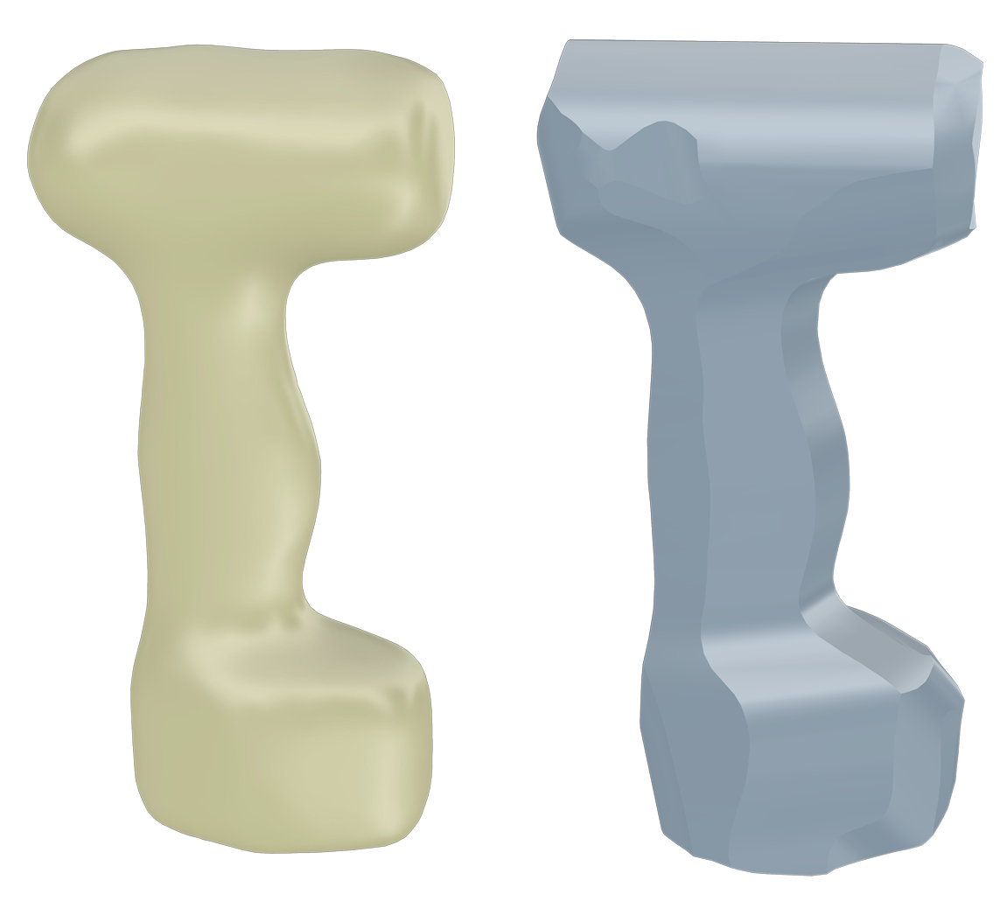

# Carving Shapes with Ruled Surfaces for Rough Machining

## Dataset
Here is input meshes data in our paper. 

- [Data](https://pan.baidu.com/s/1Taz6jCuYxsIRs4xPtouuDw?pwd=mxi7)

## Installation

#### Via CMake

Our code is a mixture of C++ and matlab programming, and its dependent libraries are as follows:

- OpenCASCADE
- OpenMesh
- CGAL
- Eigen
- Libigl
- OpenGJK

## Usage

Create a new "build" folder. After Cmake compiles, create a folder to store the results, such as "build/shape1",
Put the input mesh "shape1.obj" in this folder.

Write the parameters of the article into "input_info.txt". Such as, seg_param0, seg_param1, seg_param2, seg_param3, seg_param4, seg_param5, seg_param6

- seg_param0: The location of the folder used to store the results
- seg_param1: The initial number of direction lines
- seg_param2: The maximum length of a initial direction line
- seg_param3: Used to calculate the interval between adjacent rulings
- seg_param4: Used to calculate the height of a ruling
- seg_param5: The number of sampling points on a ruling
- seg_param6: Parameters used to calculate the coverage area

  

We have provided the "input_info.txt" used by "shape1" in our project. So you can directly run the code to obtain the result in the picture.